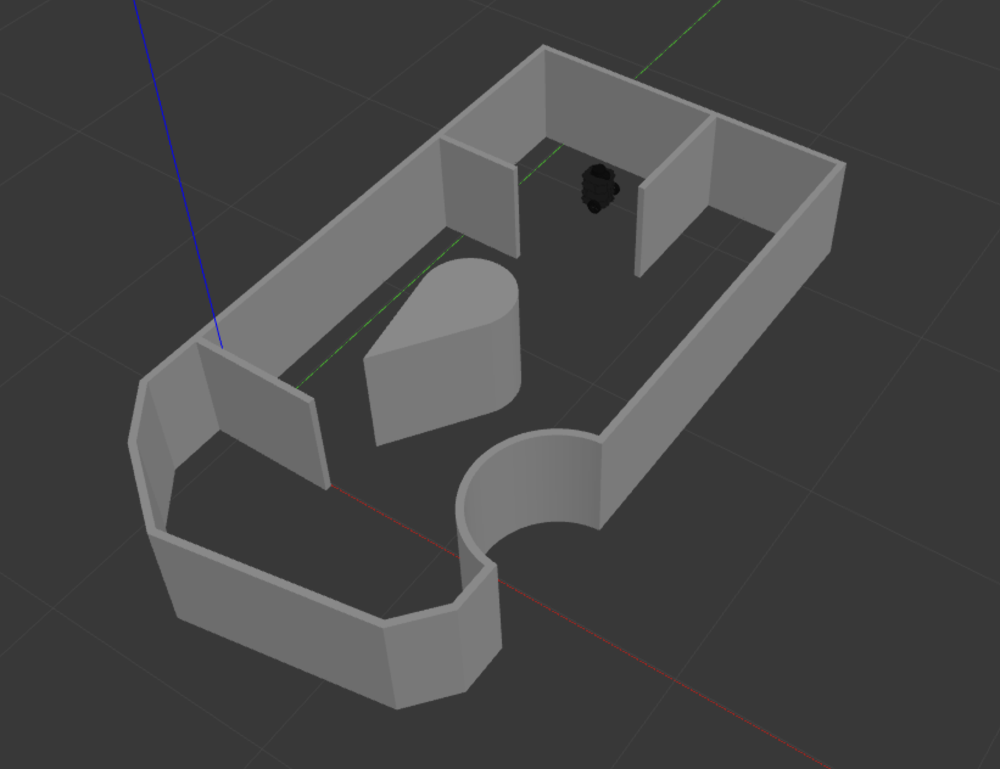

# RBE 3002 Final Demo

## Running with move_base stack
To see what a working project looks like run the below commands in order:
```bash
$ roscore
$ roslaunch lab4 world_sim.launch world:=turtlebot
$ roslaunch lab4 practice_exploration.launch
```
This setup works the same way your existing code does, give the robot a 2D nav goal in rviz and the turtlebot will move there. Keep in mind that you will get a 40 percent penatly if you use `move_base` in your final project.

## TurtleBot Maze World Screenshot

